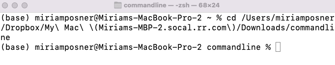
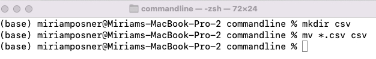

# Getting started with Unix

## 1. Introduction
- Level: Absolute beginner who has had a general, conceptual introduction to Unix (like [this](http://www.ee.surrey.ac.uk/Teaching/Unix/unixintro.html))
- Time: 20-50 min's, depending on student's comfort level
- Watch for: 
    - Make sure PC users download Git for Windows, and that Git Bash appears in their start menu. 
    - Make sure that all students download the sample files.
    - Make sure that all students, especially PC users, unzip ("extract") the folder they download. 
    - It's possible that some of the students' folders have surprising permissions; be prepared for that. 
    - Some students may have Chromebooks, which require [special handling](https://melaniewalsh.github.io/Intro-Cultural-Analytics/01-Command-Line/01-The-Command-Line.html#chromebook). 
    - Because students on PCs can't enter paths by dragging and dropping file icons, they have a tendency to get stuck at Step 10. It's good to know that PCs have multiple desktops; if a student can't find the folder they downloaded, it may be because they're at the desktop (or downloads folder) of the wrong user profile. 

Every Mac comes equipped with a program called **Terminal.** This program allows you to communicate via typing with your Unix operating system. (Sometimes people call this **using the command line.**)

PCs don’t use Unix operating systems, but you can download programs that allow you to interact with your computer in the same way. For PCs, we'll use [Git for Windows](https://gitforwindows.org/), a download that includes a program called **Git Bash.** The download process for Git for Windows includes a lot of boxes to check; [these instructions will walk you through the settings](https://adamtheautomator.com/git-bash/#:~:text=After%20downloading%20Git%2C%20let%E2%80%99s%20start%20installing%20it%20on%20your%20Windows%20PC.). Git Bash will allow you to interact with your PC using textual commands, just like on Unix-based systems.

Why would you want to do this? While graphical user interfaces (GUIs) are convenient, using the command line allows you to perform actions programmatically and to chain actions together so that, in many cases, you can perform a task much more quickly (or, in some cases, at all). Plus you look cool.

You’ll hear the terms terminal, bash, shell, CLI, command line, and Unix used frequently (and often overlapping) to refer to this kind of work. [Here’s an explanation of these terms](https://www.geeksforgeeks.org/difference-between-terminal-console-shell-and-command-line/). For now, it’s really just important to know that we’re working in the shell.

Before we get started, download [t](https://www.dropbox.com/s/x0i689m2lfivb3i/commandline.zip?dl=1)[his file](https://www.dropbox.com/s/az13rafkll81a6t/commandline%202.zip?dl=1) of sample data and decompress it. Make sure you’ll be able to find it again later.

## 1. Open your terminal

### On a Mac: 
To get started, use your computer’s search function (or press **command** and the **space bar**) and search for the terminal. (You can also open it by looking in your computer’s **Utilities** folder.)

Then open it!

### On a PC: 
Locate the program called Git Bash. If you kept all the default settings during installation, it should be available on your Start menu. If it’s not there, use your computer’s search function to locate Git Bash. Going forward, you’ll mostly see images of the Mac’s terminal, but these instructions should also work on Git Bash.

### On a Chromebook:
Please follow the instructions [here](https://melaniewalsh.github.io/Intro-Cultural-Analytics/01-Command-Line/01-The-Command-Line.html#chromebook).

## 3. What are we looking at?

This is a terminal window, also called a shell! It has a **command prompt** waiting for you to tell it what to do. You can tell it's waiting for you to type something because it displays a **%** (or a **$**, they mean the same thing).

To work in the shell, you'll type out a command and then press return. Let's try our first command. Type

    whoami 
    

and press return. The terminal returns your username. (Mine's miriamposner.)

And now the command prompt displays again, ready for you to issue your next instruction.

## 4. Say hello

This is another easy one. Type

    echo 'Hello world'
    

and press return. The command **echo** instructs the terminal to repeat whichever characters you include in the quotation marks.

Great! Now you should see the command prompt again.

## 5. Getting around in the terminal

As you've probably already noticed, you can't do too much in the terminal using your mouse. Instead, the terminal awaits typed commands. Here are some commands that may make your life a little easier:

Use the **up and down arrows** on your keyboard to move back (up) and forward (down) through the previous commands you typed. This often saves you typing. Try pressing the up arrow once to rewind to the **echo** command you typed earlier. Then use the left and right arrows to delete the current contents of the quotation marks, replacing them with whatever you want. Then press **return**.

To move to the start of a line: hold down the **control** key and then press **a**

To move to the end of a line: **control e**

To clear the screen: type **clear** into the terminal and press return

To quit: type **exit** or just close the window (but don't do that yet!!)

## 6. Get your bearings (1)

When you're using the terminal, you're always working from somewhere on your computer. In order to understand where that is, you need to learn a little bit about **paths**.

Your computer's file system is an upside-down tree. The root is your hard drive. In the next set of branches come a set of folders (also called "directories") that are used by everyone who uses your computer. In the folder called **users** are folders for different user profiles (the desktop you see when you log into your computer), and beneath that, usually, is a set of folders associated with your user profile, including Applications, Desktop, Documents, Downloads, etc. Each of these folders hold their own files or folders, each of *these* folders might contain their own folders, and so on.

When you move up and down the tree, you're moving closer or farther from the root, along the different branches.

By default, when you use the terminal, you're dropped just below the root, into the folder for your user profile.

In the image below, the circles represent folders (AKA directories) and the uncircled nodes represent individual files.

## 7. Get your bearings (2)

Let's make this more concrete. In the terminal window, type this command:

    pwd
    

(That stands for "print working directory.") You should see something like this:

    /Users/miriamposner
    

This is called a path! That's because it leads to your location. When you see a backslash (**/**) at the start of a path, that stands for the root of your computer. Subsequent slashes indicate that you're moving into a subfolder. So, in the path above, I'm in the miriamposner folder, which is inside the Users folder, which is located at the root of my computer! You should be in the folder associated with the name of your own profile. (But if you're not, it's not a big deal!)

## 8. Meet your neighbors

Let's see what's in the same folder as you. Type

    ls
    

and press return. This command means "list" and it will list your cohabitants within the folder for your user profile. (Hmm, I really need to clean out my computer! What even are those folders?)

You'll probably see a list of folders like those in the image. Generally, you can tell you're looking at a folder because the name is not followed by a file extension (e.g., .doc, .xls, .txt). A name followed by a file extension usually indicates that you're looking at a file.

## 9. Move down the tree

Now that we know where we are, let's try moving down our branch. Type

    cd Desktop
    

(Or the name of another folder at the same level as you.) Better yet, type

    cd Desk
    

and then press the tab key. The terminal will autocomplete for you! Then press return. (It won't autocomplete if you just press** D**, however. That's because you're not being specific enough; you have both a Desktop folder and a Downloads folder.)

The command **cd** stands for "change directory," and it will take you into the folder you specify. When we navigate around the file system that way, we say that we're using **relative paths** -- that is, they're relative to our position in the tree. **Absolute paths** start at the root and use slashes to indicate subfolders. The path you saw in the sixth step is an example of an absolute path. You can use either relative paths or absolute paths with the **cd** command.

Once you've executed the **cd** command, you should be at your computer's desktop (or whichever folder you specified). You can tell because the name of the folder appears in the command prompt.

Type **ls** to see what's on your desktop. If you're like me, it's too many screenshots.

## 10. Move back up the tree

Let's head back up toward the root. Type

    cd ..
    

The two adjacent periods (**..**) are a special code that tells the computer to move up the tree one folder. So this will take you back up to where you were before you cd'd the first time.

## 11. Move into a specific folder

There's a cool way to move directly into the folder you're interested in. We'll use this trick to navigate to the folder you downloaded at the beginning of this tutorial. First, type

    cd
    

Next locate the icon for the folder your downloaded. (Mine is in my Downloads folder.)

Then drag the folder icon directly onto the terminal window and drop it there. The terminal will automatically display the folder's absolute path. (My path looks weird because I have Dropbox installed on my computer.) 

Then type **control e** to move your cursor to the end of the line.

When you press **return** (from anywhere on the line you typed), you'll be taken into the folder you dropped into the terminal. (Confused? [Watch me do it](https://youtu.be/COnbjVzOscA).)

You can type

    pwd
    

and press return to confirm you're where you want to be.

## 12. Magically create a file

Now we can start to get a sense of what you can do with the command line. We'll start with something easy but cool. Type the following into your terminal

    touch magicfile.txt
    

and press return. Now look inside the **commandline** folder you downloaded. You should have a new file called **magicfile.txt**.

That's what the **touch** command does: It creates an empty file. Open magicfile.txt and type something in it. Then save the document and close it.

## 13. Check your work

Now, back in your terminal window, type

    cat magicfile.txt
    

(Or you can type **cat m** and press the tab key!)

Your terminal window now shows you the contents of your new file.

## 14. Concatenate! (1)

Let's see what else cat (concatenate) can do. Back in your terminal window, type:

    cat *.txt > mergedfile.txt
    

Then press **return**. In the statement we just typed, **cat** is the command. **\*.txt** is what we want to concatenate. The asterisk (\*) acts as a wildcard: It can stand for any string of characters. Then we have an arrow, and finally the name of the new file we want to create.

So, essentially, you've told your computer, "Concatenate all the files in this folder with the file extension .txt and put their contents in a new document called mergedfile.txt."

After you've run the command, check inside your **commandline** folder. You should have a new file that merges all of your text files into one!

## 15. Concatenate! (2)

That was fun, so let's do it again. This time, type

    cat *.csv > mergedfile.csv
    

and press return. Can you tell what we're doing? This time we're telling the computer to concatenate every file in the folder with the file extension **.csv.**

When you're done, check in your commandline folder. The document **mergedfile.csv** should now contain data from both spreadsheets! (In order to concatenate like this, the layout of both sheets must be identical; otherwise you'll have columns with different data in them.)

## 16. Remove files!

I grow tired of these files! Let's get rid of them. This time, type

    rm mergedfile*
    

We're using the command **rm**, which removes the designated items. This time we've told the computer to remove anything whose name starts with **mergedfile**.

## 17. Move files!

Let's keep cleaning things up. I'm going to make a new folder (AKA directory) to hold my CSV files. Type

    mkdir csv
    

This tells your computer to make a new directory called csv.

Now let's move those CSVs. Type

    mv *.csv csv
    

See what we did? We used the **mv** (move) command to move everything with the file extension **.csv** into the **csv** folder! Much neater.

Can you do the same for the text files?

## 18. Get a word count

If each of my text files contained a chapter in my novel and I wanted to see how many pages I had total, I could open each document individually, check the word count, and then add up all the values.

We're too smart to do that, though. We're going to use the **wc** command. (Before you run this command, you may have to **cd** into a subfolder if you created a directory for your text files in the last step!)

Type

    wc *.txt
    

The command **wc** means, appropriately enough, "word count." And there's that wildcard again! This time, we told our computer to add up the words contained in every document with the file extension **.txt**.

Hmm, looks like I've got a ways to go on my novel...

## 19. A little about syntax

You're almost done, but before you go, here's some information that will help you understand Unix commands if you encounter them on the web.

You've already seen **commands**; they tell your computer to do something. Many commands also have **options**, which are indicated by a hyphen (-). For example, you could type

    ls -a
    

which would force your terminal to display all of the files in a directory, including the ones that are usually hidden. Sometimes these are called **flags** or **switches**.

Finally, commands can have **arguments.** They tell your computer what to perform the operation on -- for example, a particular file or directory.

For example, you could type

    ls -a csv
    

from inside your commandline folder to get a list of everything in your **csv** folder. 

Commands don't need to have arguments or options, and they can have more than one of both.

You can also chain together multiple commands using the vertical bar (|), often called a **pipe**.

## 20. Great job!

You've navigated the terminal! Now that you know about it, you'll find lots of opportunities to use it.

Here's a [cheat sheet](https://www.guru99.com/linux-commands-cheat-sheet.html) for you! And if you're ready to start learning more, [this lesson]([https://swcarpentry.github.io/shell-novice/03-create/index.html#copying-files-and-directories](https://swcarpentry.github.io/shell-novice/04-pipefilter.html)) will show you how to use more advanced Unix commands.

